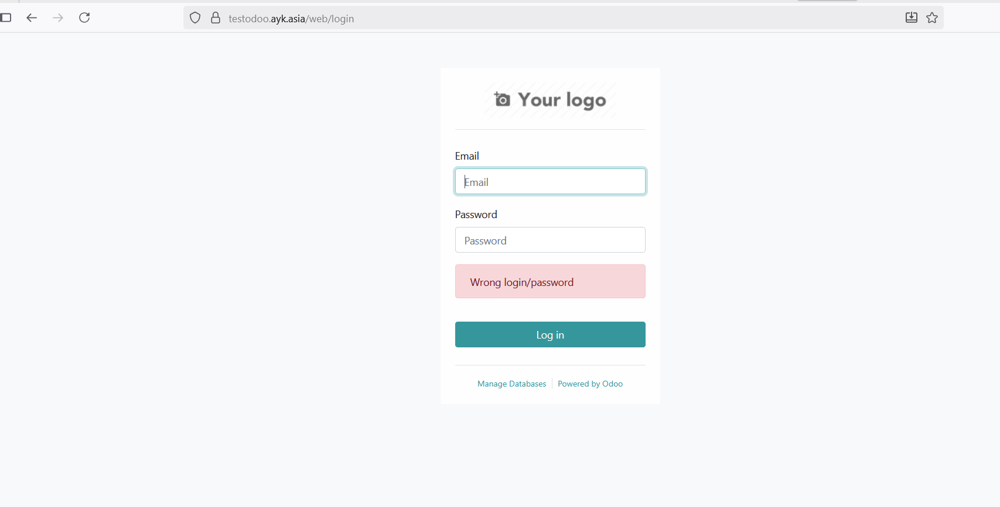

# How-To-Install-Odoo-with-Docker-on-Ubuntu
How To Install Odoo with Docker on Ubuntu

ubuntu on docker instllation offical link 
```
https://docs.docker.com/engine/install/ubuntu/
```
docker compose install offical link
```
https://docs.docker.com/compose/install/linux/
```
Create directory
```
mkdir ~/odoo
cd ~/odoo
```
create docker-compose.yml 
```
nano docker-compose.yml
```
```
version: '3'
services:
  odoo:
    image: odoo:15.0
    env_file: .env
    depends_on:
      - postgres
    ports:
      - "8069:8069"  # ✅ Expose Odoo publicly
    volumes:
      - data:/var/lib/odoo

  postgres:
    image: postgres:13
    env_file: .env
    volumes:
      - db:/var/lib/postgresql/data/pgdata

volumes:
  data:
  db:
```
Open a new .env file with nano:
```
POSTGRES_DB=postgres
POSTGRES_PASSWORD=enter_your_db_password
POSTGRES_USER=odoo
PGDATA=/var/lib/postgresql/data/pgdata

HOST=postgres
USER=odoo
PASSWORD=enter_your_password

```
To generate a password for Odoo and PostgreSQL, use the openssl command, which should be available on most Linux systems. Run the following command on your server to generate a random set of bytes and print a base64 encoded version that you can use as a password:
```
openssl rand -base64 30
```
You’re now ready to start the odoo and postgres containers with the docker-compose command:
```
docker compose up -d
```
```
root@testodoo:~/odoo# docker ps
CONTAINER ID   IMAGE         COMMAND                  CREATED          STATUS                                                                                                                       PORTS                                                        NAMES
0bb3b5d67459   odoo:15.0     "/entrypoint.sh odoo"    33 seconds ago   Up 33 sec                                                                                                             onds   0.0.0.0:8069->8069/tcp, [::]:8069->8069/tcp, 8071-8072/tcp   odoo-odoo-1
6642a7ba4723   postgres:13   "docker-entrypoint.s…"   33 seconds ago   Up 33 sec                                                                                                             onds   5432/tcp                                                     odoo-postgre                                                                                                             s-1
```
user link call 
```
http://your_server_ip:8069
```


# install and nginx configuration
packet update and nginx install 
```
sudo apt update
sudo apt install nginx
```
open up a new Nginx configuration file in the /etc/nginx/sites-available directory. We’ll call ours odoo.conf but you could use a different name:
```
sudo nano /etc/nginx/sites-available/odoo.conf
```
```
server {
    listen       80;
    listen       [::]:80;
    server_name  your_domain_here;

    access_log  /var/log/nginx/odoo.access.log;
    error_log   /var/log/nginx/odoo.error.log;

    location / {
      proxy_set_header X-Forwarded-For $proxy_add_x_forwarded_for;
      proxy_set_header X-Real-IP $remote_addr;
      proxy_set_header X-Forwarded-Host $host;
      proxy_set_header X-Forwarded-Proto https;
      proxy_pass http://localhost:8069;
  }
}
```

Save and close the file, then enable the configuration by linking it into /etc/nginx/sites-enabled/:
```
sudo ln -s /etc/nginx/sites-available/odoo.conf /etc/nginx/sites-enabled/
```
### Go to your domain portal on dns A record added your server ip and domain ip mapping

```
root@testodoo:~# sudo nginx -t
nginx: the configuration file /etc/nginx/nginx.conf syntax is ok
nginx: configuration file /etc/nginx/nginx.conf test is successful
root@testodoo:~#

```
Installing Certbot and Setting Up TLS Certificates
```
sudo apt install certbot python3-certbot-nginx
sudo certbot --nginx -d testodoo.ayk.asia

sudo nano /etc/nginx/sites-available/odoo.conf


# /etc/nginx/sites-available/odoo.conf
# Replace BACKEND_IP with 127.0.0.1 if Odoo runs locally, otherwise keep the remote IP.
# Example: set BACKEND_IP 127.0.0.1;

map $http_upgrade $connection_upgrade {
    default upgrade;
    ''      close;
}

server {
    listen 80;
    listen [::]:80;
    server_name testodoo.ayk.asia;
    # Redirect all HTTP to HTTPS
    return 301 https://$host$request_uri;
}

server {
    listen 443 ssl;
    listen [::]:443 ssl;
    server_name testodoo.ayk.asia;

    access_log  /var/log/nginx/odoo.access.log;
    error_log   /var/log/nginx/odoo.error.log;

    # SSL managed by Certbot
    ssl_certificate /etc/letsencrypt/live/testodoo.ayk.asia/fullchain.pem;
    ssl_certificate_key /etc/letsencrypt/live/testodoo.ayk.asia/privkey.pem;
    include /etc/letsencrypt/options-ssl-nginx.conf;
    ssl_dhparam /etc/letsencrypt/ssl-dhparams.pem;

    # Recommended limits
    client_max_body_size 200M;
    keepalive_timeout 65;

    # Proxy to Odoo main workers (adjust BACKEND_IP if needed)
    location / {
        proxy_set_header Host $host;
        proxy_set_header X-Real-IP $remote_addr;
        proxy_set_header X-Forwarded-For $proxy_add_x_forwarded_for;
        proxy_set_header X-Forwarded-Proto $scheme;

        proxy_http_version 1.1;
        proxy_set_header Connection "";

        proxy_read_timeout 720s;
        proxy_connect_timeout 30s;
        proxy_send_timeout 120s;

        proxy_buffering off;
        proxy_redirect off;

        proxy_pass http://127.0.0.1:8069;   # <-- change to http://4.194.120.115:8069 if backend is remote
    }

    # Odoo longpolling (if you run the longpolling service on 8072)
    location /longpolling {
        proxy_pass http://127.0.0.1:8072;   # <-- change if remote
        proxy_set_header Host $host;
        proxy_set_header X-Real-IP $remote_addr;
        proxy_set_header X-Forwarded-For $proxy_add_x_forwarded_for;
        proxy_set_header X-Forwarded-Proto $scheme;

        proxy_http_version 1.1;
        proxy_set_header Connection $connection_upgrade;
        proxy_set_header Upgrade $http_upgrade;

        proxy_buffering off;
        proxy_read_timeout 720s;
    }

    # Optional: static files (if Odoo exposes static assets via /web/static)
    # Let Odoo serve them via proxy (keep it simple) — you can add caching here later.
    location ~* /web/static/ {
        proxy_cache_valid 200 60m;
        proxy_buffering on;
        proxy_pass http://127.0.0.1:8069;
        proxy_set_header Host $host;
    }

    # Optional security header - enable HSTS only if you're ready to enforce HTTPS
    add_header Strict-Transport-Security "max-age=63072000; includeSubDomains; preload" always;
}

```

```
docker compose down
```

```
nano .env
```

```
POSTGRES_DB=postgres
POSTGRES_PASSWORD=enter_your_password
POSTGRES_USER=odoo
PGDATA=/var/lib/postgresql/data/pgdata

HOST=postgres
USER=odoo
PASSWORD=enter_your_password
ODOO_PROXY_MODE=True


```
```
docker compose up -d
systemctl nginx -t 
systemctl relaod nginx
```
user link call



#uplaod to docker hub

```
docker login
docker tag postgres:13 monsyster/postgres:13
docker tag odoo:15.0 monsyster/odoo:15.0
docker push monsyster/postgres:13
docker push monsyster/odoo:15.0
```
Another server testing
Pull the images from Docker Hub
```
docker pull monsyster/postgres:13
docker pull monsyster/odoo:15.0
```
Run PostgreSQL first
```
docker run -d \
  --name odoo-postgres \
  -e POSTGRES_DB=postgres \
  -e POSTGRES_USER=odoo \
  -e POSTGRES_PASSWORD=odoo \
  -p 5432:5432 \
  monsyster/postgres:13
```
Run Odoo and link it to PostgreSQL
```
docker run -d \
  --name odoo-odoo \
  --link odoo-postgres:db \
  -p 8069:8069 \
  monsyster/odoo:15.0
```

If you want these containers to persist data even if you remove them, you should use volumes:
```
docker run -d \
  --name odoo-postgres \
  -e POSTGRES_DB=postgres \
  -e POSTGRES_USER=odoo \
  -e POSTGRES_PASSWORD=odoo \
  -v pgdata:/var/lib/postgresql/data \
  -p 5432:5432 \
  monsyster/postgres:13

```


