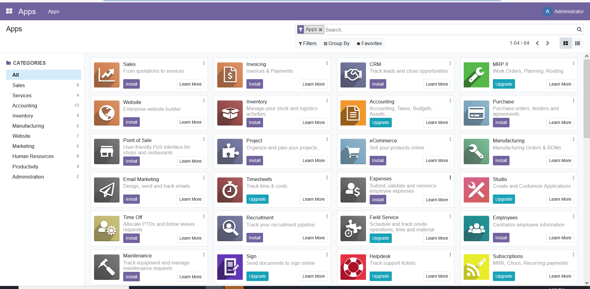

# How-To-Install-Odoo-with-Docker-on-Ubuntu
How To Install Odoo with Docker on Ubuntu

ubuntu on docker instllation offical link 
```
https://docs.docker.com/engine/install/ubuntu/
```
docker compose install offical link
```
https://docs.docker.com/compose/install/linux/
```
Create directory
```
mkdir ~/odoo
cd ~/odoo
```
create docker-compose.yml 
```
nano docker-compose.yml
```
```
version: '3'
services:
  odoo:
    image: odoo:15.0
    env_file: .env
    depends_on:
      - postgres
    ports:
      - "8069:8069"  # ✅ Expose Odoo publicly
    volumes:
      - data:/var/lib/odoo

  postgres:
    image: postgres:13
    env_file: .env
    volumes:
      - db:/var/lib/postgresql/data/pgdata

volumes:
  data:
  db:
```
Open a new .env file with nano:
```
POSTGRES_DB=postgres
POSTGRES_PASSWORD=enter_your_db_password
POSTGRES_USER=odoo
PGDATA=/var/lib/postgresql/data/pgdata

HOST=postgres
USER=odoo
PASSWORD=enter_your_password

```
To generate a password for Odoo and PostgreSQL, use the openssl command, which should be available on most Linux systems. Run the following command on your server to generate a random set of bytes and print a base64 encoded version that you can use as a password:
```
openssl rand -base64 30
```
You’re now ready to start the odoo and postgres containers with the docker-compose command:
```
docker compose up -d
```
```
root@testodoo:~/odoo# docker ps
CONTAINER ID   IMAGE         COMMAND                  CREATED          STATUS                                                                                                                       PORTS                                                        NAMES
0bb3b5d67459   odoo:15.0     "/entrypoint.sh odoo"    33 seconds ago   Up 33 sec                                                                                                             onds   0.0.0.0:8069->8069/tcp, [::]:8069->8069/tcp, 8071-8072/tcp   odoo-odoo-1
6642a7ba4723   postgres:13   "docker-entrypoint.s…"   33 seconds ago   Up 33 sec                                                                                                             onds   5432/tcp                                                     odoo-postgre                                                                                                             s-1
```
user link call 
```
http://your_server_ip:8069
```


# install and nginx configuration


